<div align="center">



# 🧨 QweTnts

**Ваш мир. Ваши правила. Собственная взрывчатка для осад QweProtectStones.**

[](#-сборка-и-разработка)
[](#-сборка-и-разработка)
[](#-эксплуатация-без-сюрпризов)    
[](https://github.com/qweyns/QweProtectionStones)
[](https://github.com/qweyns/QweTnts/actions/workflows/build.yml)

**[Быстрый старт](#-быстрый-старт) · [Динамиты](#-семь-динамитов-в-комплекте) · [Компоненты](#-компоненты-крафта) · [Пушка](#-тротиловая-пушка) · [Настройка](#-где-что-настраивается) · [Фаза 2](#-фаза-2-реализовано) · [Аудит](docs/AUDIT.md) · [План](docs/ROADMAP.md)**

[QweProtectStones](https://github.com/qweyns/QweProtectionStones) · [Сборки CI](https://github.com/qweyns/QweTnts/actions) · [Сообщить об ошибке](https://github.com/qweyns/QweTnts/issues)

</div>

---

Аддон для **QweProtectStones**: кастомные динамиты в стиле **HolyWorld Lite**
на **Paper 1.21.4 / Java 21**, с поддержкой Folia.

Каждый динамит — отдельный YAML-файл в `dynamites/`: своя мощность, фитиль,
модель разрушения блоков, урон игрокам и мобам, рейд-блоки, эффекты, предмет
и крафт. Отдельно стоит **тротиловая пушка** — блок-раздатчик, который
выстреливает заряженным в него динамитом по сигналу редстоуна (точь-в-точь
как на HolyWorld); у неё собственный файл `cannon.yml` в корне папки плагина.
Интеграция идёт через публичные события QPS
(`RegionExplosionTypeEvent`, `RegionDamageEvent`, `RegionDeletedEvent`) —
правила `explosions`, `raid_immune`, кулдауны и отменяемые события самого QPS
продолжают действовать.

Ключевая механика: **динамит не поджигает сам себя**. Он ставится блоком,
как обычный TNT, и ждёт огня — огнива, огненного заряда, лавы, молнии или
другого взрыва. Автоподжог возвращается одним ключом.

> [!IMPORTANT]
> **QweTnts — аддон, а не самостоятельный плагин.** Без QweProtectStones
> он отключается при старте. Контракт взрывов описан в
> [`docs/explosions-api.md`](https://github.com/qweyns/QweProtectionStones/blob/main/docs/explosions-api.md)
> в репозитории QPS.

## ✨ Что внутри

| 🧨 Взрывчатка | 🛡️ Осады и рейд | ⚙️ Настройка и защита |
| :--- | :--- | :--- |
| Семь динамитов + пушка | Рейд-блоки (анти-феникс) | Все параметры — в YAML |
| Поджог огнивом, огнём, взрывом | Ядро привата неразрушимо | Свои лимиты и фильтр миров |
| Цепная детонация | Деградация древних обломков | Права на каждый тип |
| Тнт-пушка, спавнер-майнинг | Урон осаде ×1…×10 | MiniMessage + 2 языка |
| Бункер замка: стена деградирует | Алерты владельцу и в Discord | `/qtnt info` и `/qtnt stats` |
| Голограмма с отсчётом над зарядом | Стена бункера деградирует | Три провайдера голограмм на выбор |

**Производность без лагов:** порционная обработка крупных взрывов, лимиты
на игрока и на чанк, кулдаун активации, все обращения к блокам — через
`RegionScheduler`, запись на диск — атомарная, в отдельном I/O-пуле.

> [!TIP]
> **Начните с Динамита A.** Он полностью задокументирован: в
> `dynamites/dynamite_a.yml` перечислены все ключи с комментариями.
> Остальные — короткие файлы, где меняется только суть.

## 🚀 Быстрый старт

1. Установите **QweProtectStones** (ветка `main`, версия `2.0.0`) и
   **QweTnts** в `plugins/`, запустите сервер на Java 21.
2. Дождитесь появления папки `plugins/QweTnts/` — в ней `config.yml`,
   `cannon.yml`, `lang/` и `dynamites/`.
3. Включите осаду (`siege.enabled: true`) в `config.yml` QPS и пропишите
   типы взрывов у приватов — см. [интеграцию](#-интеграция-с-qps-regionsyml).
4. Выполните `/qtnt list` — должен показаться список загруженных динамитов.
5. Выдайте заряд: `/qtnt give c4 <игрок> 4`.

> [!TIP]
> **Аддон включился раньше QweProtectStones?** Ничего страшного: он не
> отключается, а ждёт — `/qtnt` ответит «жду QweProtectStones», и как только
> QPS поднимется, аддон запустится сам. Такое бывает из-за цикла
> зависимостей: у нас QPS в `depend`, а в QPS QweTnts — в `softdepend`, и
> Bukkit этот цикл разрывает как умеет.

Дальше всё настраивается файлами: `config.yml` (глобальные правила),
`dynamites/*.yml` (каждый динамит отдельно) и `cannon.yml` (пушка).
После правок — `/qtnt reload`.

> [!NOTE]
> **Меняли конфиги?** `/qtnt reload` перечитывает `config.yml`, все файлы
> из `dynamites/` и `cannon.yml`, перерегистрирует рецепты и перезапускает
> периодические задачи. Рестарт сервера не нужен.

## 🧨 Восемь динамитов в комплекте

Разрушительные — как на HolyWorld Lite:

| Динамит | Суть | Мощность | Урон осаде | Крафт |
| :--- | :--- | :--- | :--- | :--- |
| **Динамит A** | Радиус урона ×3, базовый заряд | 6 | 1 | 5 пороха, 2 песка, 2 TNT |
| **Динамит B** | Радиус урона ×10 | 8 | 1 | 5 пороха, 2 песка, 2 Динамита A |
| **Динамит Б2** | Ровный куб 25×25×25, не работает в приватах | 8 | 1 | 5 Взрывчатого вещества, 4 Динамита A |
| **C4** | Ломает обсидиан, плачущий обсидиан и древние обломки, рейд-блок 5 мин | 4 | 1 | 5 пороха, 2 песка, 2 Динамита B |
| **Разрывная волна** | Работает в воде и лаве, сносит 2 прочности, ломает обсидиан | 4 | 2 | не крафтится: ивенты, `/warp unique`, `/shop` |

Специальные — **не ломают ни одного блока** (`breaking.destructive: false`):

| Динамит | Суть | Крафт |
| :--- | :--- | :--- |
| **Стиллер** | Рельеф цел, спавнер выпадает предметом: шанс 50 % | 5 пороха, 2 песка, 2 C4 |
| **Надёжный стиллер** | То же, но шанс 75 % | 5 пороха, 2 песка, 2 Стиллера |
| **Ледяная волна** | Рельеф цел, сфера льда радиусом 2 на 5 секунд | 5 TNT, 4 синего льда |

Все восемь — обычные файлы в `plugins/QweTnts/dynamites/`. Удалите ненужный
или поставьте `enabled: false` — он просто не загрузится.

> [!NOTE]
> **Тротиловая пушка — отдельная механика, а не девятый динамит.** Это блок,
> который стреляет любым из этих восьми — см. [ниже](#-тротиловая-пушка).

> [!NOTE]
> **Рецепты и способности — по вики HolyWorld Lite.** Разрывная волна не
> крафтится вовсе (`craftable: false`), как и на HW: её получают с ивентов,
> из шалкера `/warp unique` и в `/shop`. Если на сервере нужен крафт —
> рецепт лежит в файле и включается одним ключом `craftable: true`.

## 🧪 Компоненты крафта

Некоторые рецепты требуют не материал, а **конкретный предмет** — например,
Взрывчатое вещество из HolyWorld Lite: 9 пороха собираются в одну единицу
вещества, а вещество можно разложить обратно в 9 пороха.

```yaml
# dynamites/любой.yml
recipe:
  shape:
    - "EAE"
    - "AAA"
    - "EAE"
  ingredients:
    E:
      component: explosive   # требуется именно наше вещество по PDC-метке
    A:
      custom-type: dynamite_a
```

Компоненты описываются в `components.yml` в корне папки плагина. Проверка
идёт по PDC-метке, а не по материалу: подсунуть обычный порох вместо
вещества не получится.

Выдать компонент можно так: `/qtnt give component:explosive`.

## 🔥 Механика поджога

Режим задаётся у каждого динамита ключом `ignition.auto`:

```yaml
ignition:
  auto: false    # true — загорается сразу из руки, false — ставится блоком
```

Если ключ удалить, работает глобальное `settings.dynamites.auto-ignite`
из `config.yml` (по умолчанию `false` — как на HolyWorld).

| Как поджечь | Ключ в `ignition.causes` |
| :--- | :--- |
| 🔥 Огниво | `FLINT_AND_STEEL` |
| 🎯 Огненный заряд / файербол | `FIRE_CHARGE` |
| 🕯️ Огонь, распространение огня, горящая стрела | `FIRE` |
| 🌋 Лава | `LAVA` |
| 💥 Другой взрыв (цепная детонация) | `EXPLOSION` |
| ⚡ Молния | `LIGHTNING` |
| 👊 Удар кулаком | `PUNCH` |

Установка идёт через обычный `BlockPlaceEvent`, поэтому защиту приватов QPS
не обойти. Сломанный установленный динамит возвращается предметом с PDC.

## ⏱️ Голограмма над горящим зарядом

Над подожжённым динамитом появляется табличка с обратным отсчётом: видно,
сколько секунд осталось до взрыва. Работает и на снаряде пушки — табличка
едет вместе с зарядом. Устроено так же, как голограммы приватов в
QweProtectStones: три провайдера на выбор и те же ключи оформления.
Подробности — в [`docs/holograms.md`](docs/holograms.md).

```yaml
# config.yml — отдельная секция в корне файла
holograms:
  enabled: true
  provider: AUTO          # AUTO | FANCY | DECENT | NATIVE
  max-active: 48          # предел числа голограмм, 0 — без предела
  follow-projectile: true # ехать за зарядом
  update-interval-ticks: 5
  offset: 1.1             # высота над зарядом
  display-range: 24
  lines:
    - "<#FDE68A>⚡ <#F2EFFA>%seconds% с"
    - "<#A79FC0>%name%"
  settings:
    see-through: false
    shadow: true
    scale: 1.0
    billboard: CENTER
    text-alignment: CENTER
    background: ""
    permission: ""
```

| Провайдер | Что делает |
| :--- | :--- |
| `AUTO` (по умолчанию) | FancyHolograms, иначе DecentHolograms, иначе встроенные |
| `FANCY` | только FancyHolograms; нет плагина — встроенные |
| `DECENT` | только DecentHolograms; нет плагина — встроенные |
| `NATIVE` | всегда встроенные голограммы на `TextDisplay` |

На Folia мосты не работают, поэтому там всегда встроенные. Ванильный TNT
аддон не оформляет — голограммы только у своих динамитов.

| Подстановка | Что показывает |
| :--- | :--- |
| `%seconds%` | сколько секунд до взрыва |
| `%ticks%` | сколько тиков фитиля осталось |
| `%name%` | название динамита |
| `%player%` | кто поджёг; неизвестен — прочерк |

Свою голограмму можно задать любому динамиту секцией `hologram:` в его
файле. Она **накладывается** на общие настройки, а не заменяет их целиком:
чего в секции нет, берётся из `config.yml`.

```yaml
# dynamites/c4.yml
hologram:
  enabled: true
  lines:
    - "<#FB7185>☠️ <#F2EFFA>%seconds% с"
    - "<#A79FC0>%name% · %player%"
```

## 🔫 Тротиловая пушка

Точная копия механики HolyWorld: **Тнт-пушка — это блок-раздатчик**, а не
динамит. Она не взрывается сама, а выстреливает тем зарядом, который в неё
положили. Файл настроек — `cannon.yml` в корне папки плагина.

Как пользоваться:

1. **Поставить блоком.** Дуло смотрит туда же, куда у раздатчика — то есть
   на игрока, который его ставил.
2. **ПКМ — открыть меню.** Окно 3×3: вокруг центрального слота **красные
   стеклянные панели**, которые нельзя взять, сдвинуть или заменить. В центр
   кладётся динамит — можно сразу стопку.
3. **Подать сигнал редстоуна — выстрел.** За один импульс улетает **один**
   заряд, остаток остаётся лежать в пушке.

Запущенный снаряд **сохраняет все свои свойства**: правила ломания, урон,
рейд-блоки, спавнер-майнинг и тип взрыва для QPS — всё работает так же, как
если бы этот динамит просто подожгли. Заряжать можно и кастомные динамиты,
и обычный ванильный TNT.

```yaml
# cannon.yml — корень папки плагина
launch:
  speed-blocks-per-second: 5.0   # как на HolyWorld: 5 блоков в секунду
  max-range-blocks: 20           # 0 — без лимита
  upward: 0.0                    # вертикальная добавка: снаряд летит выше дугой
  gravity: true                  # false — летит по прямой, как ракета
  delay-ticks: 4                 # задержка от сигнала до выстрела
```

**Дальность** настраивается двумя ключами: скоростью и пределом. Предел
(`max-range-blocks`) не «рубит» полёт, а укорачивает фитиль — снаряд
взрывается ровно там, где заканчивается дистанция.

**Что можно заряжать** — списком и режимом:

```yaml
ammunition:
  # BLACKLIST — можно всё, кроме списка; WHITELIST — только из списка
  mode: BLACKLIST
  # id динамитов из dynamites/ + особый id tnt для ванильного TNT
  dynamites: []
```

Примеры: `WHITELIST` + `[dynamite_b, tnt]` — только Динамит B и ванильный TNT;
`BLACKLIST` + `[c4]` — всё, кроме C4.

Остальные настройки пушки:

| Секция | Ключи | За что отвечает |
| :--- | :--- | :--- |
| `item` | `material`, `display_name`, `lore`, `glow`, `custom-model-data`, `item-model`, `unbreakable` | сам предмет пушки |
| `craftable` / `recipe` | — | крафт (по умолчанию **выключен**, как на HolyWorld) |
| `menu` | `title`, `border-material`, `border-name` | окно зарядки и рамка вокруг слота |
| `launch` | `speed-blocks-per-second`, `max-range-blocks`, `upward`, `gravity`, `delay-ticks` | как и куда стреляет |
| `ammunition` | `mode`, `dynamites` | чем можно заряжать |
| `worlds` | `mode`, `allowed-worlds`, `blocked-worlds` | где пушка работает (`INHERIT` — как в `config.yml`) |
| `effects.on-shot` | `sound`, `category`, `volume`, `pitch`, `particle`, `particle-count`, `spread` | эффект выстрела |
| `permission` | — | право на пушку (по умолчанию `qwetnts.cannon`) |

> [!NOTE]
> **Как получить пушку.** На HolyWorld её нельзя скрафтить, поэтому крафт
> выключен: выдавайте через `/qtnt give cannon`. Готовый рецепт лежит в
> `cannon.yml` — поставьте `craftable: true`, если пушка должна крафтиться.

## 🏰 Бункер замка (стена под обстрелом)

Ивент HolyWorld: в комнате под замком стоит **стена**, а напротив неё —
пушка. Игроки заряжают пушку динамитом, снаряд летит в стену, и у каждого
типа динамита свой шанс снять одну стадию:

| Заряд | Шанс за выстрел |
| :--- | :--- |
| Ванильный TNT, Б2, Стиллер, Надёжный стиллер, Ледяная волна | `0.4 %` |
| Динамит A | `0.8 %` |
| Динамит B | `2 %` |
| C4 | `5 %` |
| Разрывная волна | `12.5 %` |

Стена не исчезает сразу, а **деградирует целиком**: древние обломки →
плачущий обсидиан → обсидиан → пробоина.

```yaml
# bunker.yml — корень папки плагина
enabled: false
world: "world"
wall:
  from: -8, 40, -8        # два любых противоположных угла: x, y, z
  to: 8, 55, 8
  stages:
    - ANCIENT_DEBRIS      # первая ступень — самая прочная
    - CRYING_OBSIDIAN     # вторая
    - OBSIDIAN            # третья
    - AIR                 # четвёртая — всегда последняя
  hit-margin: 3           # на сколько блоков вокруг считать попадание
  protect: true           # стену нельзя подорвать ничем, кроме шанса от пушки
chances:
  default: 0.4            # проценты, дробные значения работают
  c4: 5.0
  shockwave: 12.5
cooldown-millis: 500      # один ролл не чаще раза в полсекунды на весь бункер
respawn:
  enabled: true           # стена возвращается сама…
  interval-minutes: 60    # …через столько минут
  random-stage: true      # стадия при появлении случайна, как на HolyWorld
announce: true
reward:
  commands: []      # команды от имени консоли: шалкер ставит другой плагин
```

**Четыре правила, которые важно знать:**

1. **Считаются только выстрелы из пушки.** Снаряд помечается PDC
   `qwetnts:cannon-shot`. Подойти к стене с C4 в руках и подорвать её
   нельзя: блоки стены вычищаются из списков разрушения (`protect: true`).
2. **За выстрел — один ролл**, а не ролл на каждый задетый блок: иначе
   залп из десяти пушек крутил бы шанс десять раз подряд.
3. **Награду выдаёт не аддон.** Он выполняет команду от имени консоли,
   а шалкер с добычей ставит тот плагин, который на сервере отвечает за
   ивенты:

   ```yaml
   reward:
     commands:
       - "myevents spawn shulker %world% %x% %y% %z% %player%"
   ```

   Подстановки: `%player%` — кто пробил стену (`—`, если выстрел был не от
   игрока), `%world%`, `%x%`, `%y%`, `%z%` — центр стены. Пустой список —
   награды нет.
4. **Восстановление — и по таймеру, и вручную:** `/qtnt bunker reset`.

Состояние стены (`bunker-state.yml`) переживает рестарт: если стена уже
пробита, она не «починится» сама по перезапуску.

| Команда | Что делает |
| :--- | :--- |
| `/qtnt bunker` | статус: стадия, материал, сколько до восстановления |
| `/qtnt bunker reset` | вернуть стену в исходное состояние |
| `/qtnt bunker stage <n>` | выставить стадию вручную (проверить механику, не дожидаясь удачи) |

## ⚙️ Где что настраивается

| Файл | Назначение |
| :--- | :--- |
| `config.yml` | Язык, автоподжог, анти-лаг, рейд-блоки, временные блоки, алерты, голограммы, bStats |
| `components.yml` | Компоненты крафта: Взрывчатое вещество и другие предметы-ингредиенты |
| `dynamites/*.yml` | Каждый динамит отдельно: поджог, взрыв, разрушение, лимиты, эффекты, предмет, крафт |
| `cannon.yml` | **Тротиловая пушка**: меню, скорость и дальность выстрела, список разрешённых зарядов |
| `bunker.yml` | **Бункер замка**: зона стены, стадии деградации, шансы пробития, респавн |
| `bunker-state.yml` | Текущая стадия стены (создаётся сам, переживает рестарт) |
| `lang/*.yml` | Сообщения: `ru_RU`, `en_US` (MiniMessage, как в QPS) |
| `raid-blocks.yml` | Метки рейд-блоков (создаётся сам, переживает рестарт) |
| `temporary-blocks.yml` | Временный лёд (создаётся сам, переживает рестарт) |
| `placed.yml` | Установленные, но не подожжённые заряды |

## 🎛️ Настройки динамита

| Секция | Ключи | За что отвечает |
| :--- | :--- | :--- |
| `placement` | `placeable`, `consume-on-use`, `permission`, `permission-required` | можно ли ставить, тратить ли предмет, своё право |
| `ignition` | `auto`, `causes`, `delay-ticks` | **автоподжог**, чем можно поджечь, задержка |
| `ignition.chain` | `enabled`, `can-be-chained`, `radius`, `delay-ticks` | цепная детонация |
| `explosion` | `type`, `radius-multiplier`, `power`, `fire`, `fuse-seconds`, `fuse-spread-ticks`, `works-in-water`, `works-in-lava`, `siege-damage`, `max-blocks` | параметры взрыва |
| `damage` | `cut-entity`, `cut-player`, `multiplier` | урон игрокам и мобам; радиус поиска заряда — `settings.dynamites.damage-source-radius-blocks` в `config.yml` |
| `breaking` | `vanilla-blocklist`, `max-resistance`, `resistance-scale`, `default-drop-chance`, `scan-radius`, `blocks` | что именно ломает |
| `transforms` | `chain`, `chain-chance`, `MATERIAL: {to, chance}` | деградация по ступеням и точечные превращения |
| `raid-block` | `enabled`, `duration-seconds`, `materials`, `radius` | анти-феникс |
| `spawner-mining` | `enabled`, `chance`, `xp`, `keep-entity-type` | выбивание спавнеров предметом |
| `temporary-blocks` | `enabled`, `material`, `radius`, `chance`, `duration-seconds`, `replace` | временный лёд вокруг эпицентра |
| `regions` | `only-outside` | `true` — заряд не срабатывает внутри чужих приватов (механика Динамита Б2) |
| `limits` | `cooldown-millis`, `max-primed-per-player`, `max-primed-per-chunk`, `worlds` | свои лимиты (`-1` = из `config.yml`) |
| `effects` | `on-place`, `on-ignite`, `on-explode` | звук, категория, громкость, частицы |
| `item` | `material`, `display_name`, `lore`, `glow`, `custom-model-data`, `item-model`, `unbreakable` | предмет |
| `messages` | `placed`, `ignited` | переопределение сообщений (пусто = из lang) |
| `recipe` / `craftable` | `shape`, `ingredients`, `custom-type` | крафт, в том числе из других динамитов |

Образец со всеми ключами и комментариями — `dynamite_a.yml`.

### 🎨 Оформление предметов

Название и лор пишутся MiniMessage (старые `&c`-коды тоже понимаются),
формулировки — как на HolyWorld Lite, а цвета — из палитры QweTnts:

```yaml
item:
  material: TNT
  display_name: "<gradient:#FB7185:#FCA5A5>C4 Взрывчатка</gradient>"
  lore:
    - ""
    - "<#A79FC0> ▪ <#F2EFFA>Радиус как у обычного динамита."
    - "<#A79FC0> ▪ <#F2EFFA>Ломает обсидиан, плачущий обсидиан и древние обломки."
    - "<#A79FC0> ▪ <#FB7185>Рейд-блок на 5 минут на месте взрыва."
    - ""
    - "<#A79FC0><italic>Крафт: 5 пороха, 2 песка и 2 «Динамит B»."
```

| Цвет | За что отвечает |
| :--- | :--- |
| `#FF6B35 → #FFB347` | градиент префикса в чате: «огонь» — отличие от QweProtectStones |
| `#FB7185` | ошибка, запрет, угроза |
| `#86EFAC` | успех |
| `#FDE68A` | значение: число, ник, название |
| `#F2EFFA` | основной текст |
| `#A79FC0` | пояснение и маркер ` ▪ ` |

Цвет названия растёт вместе с силой: A — жёлтый, B — оранжевый,
C4 — красный, Разрывная волна — сиреневая, Б2 и Ледяная волна —
циановые, Стиллеры — фиолетовые. Пушка и Взрывчатое вещество
оформлены в тона префикса.

## 💥 Как динамит ломает блоки

Vanilla кладёт в `blockList` только то, что разрушил бы обычный TNT —
обсидиан туда не попадает никогда. Поэтому судьба блока решается так:

1. **Неразрушимое** (бедрок, порталы, командные блоки) — не трогаем.
2. **Цепочка деградации** `transforms.chain` — блок снимает одну ступень:
   древние обломки → плачущий обсидиан → обсидиан → дыра. Проверяется
   **раньше** правил ломания, иначе прочный блок исчезал бы целиком.
3. **Явное правило** `breaking.blocks.<MATERIAL>` — решает в первую очередь:
   именно так C4 и Разрывная волна ломают обсидиан.
4. **Трансформация** `transforms.<MATERIAL>` — блок не исчезает, а
   превращается (например, укреплённый сланец → обсидиан).
5. **Расчёт сопротивления** — эффективное сопротивление
   `(resistance + 0.3) * resistance-scale` сравнивается с силой взрыва и
   потолком `max-resistance`.
6. **Отдельный скан** — прочные блоки вокруг эпицентра ищутся в радиусе
   `scan-radius` (не больше `max-break-scan-radius` из `config.yml`).
7. **Досмотр привата** — каждое решение проверяется через QPS.

### Деградация по ступеням

Та же механика, что у стены бункера, но для обычных блоков мира: заряд не
выбивает прочный блок сразу, а снимает одну ступень за раз.

```yaml
transforms:
  chain:
    - ANCIENT_DEBRIS      # первая ступень — самая прочная
    - CRYING_OBSIDIAN     # вторая
    - OBSIDIAN            # третья
    - AIR                 # четвёртая — дыра
  chain-chance: 100        # шанс снять ступень (проценты)

  # Точечные правила для материалов вне цепочки работают как раньше:
  REINFORCED_DEEPSLATE:
    to: OBSIDIAN
    chance: 100
```

Если материал описан и в цепочке, и отдельным правилом — побеждает цепочка,
и об этом пишется в лог при загрузке. Включено у **Разрывной волны**; у C4
пример лежит в `c4.yml` закомментированным — включите, если нейзерит должен
быть крепче.

## 🚀 Фаза 2 (реализовано)

### Порционная обработка крупных взрывов

Все отложенные изменения блоков группируются по чанкам и режутся на порции:
за один тик меняется не больше `large-explosion-blocks-per-tick` позиций,
следующая порция — через `large-explosion-tick-period` тиков.

```yaml
settings:
  anti-lag:
    large-explosion-blocks-per-tick: 512
    large-explosion-tick-period: 1
```

### Спавнер-майнинг

Vanilla при взрыве просто удаляет спавнер без дропа. Секция
`spawner-mining` возвращает его предметом, сохраняя тип mob'а:

```yaml
spawner-mining:
  enabled: true
  chance: 40        # шанс выпадения, 0..100 (0 — спавнер исчезает, как в vanilla)
  xp: 25            # сколько опыта выпадет
  keep-entity-type: true
```

### Временные блоки (лёд)

Вокруг эпицентра ставится `material` (например, `ICE`) на месте блоков из
списка `replace`, а через `duration-seconds` возвращается **исходный**
материал. Учёт переживает рестарт сервера.

```yaml
temporary-blocks:
  enabled: true
  material: ICE
  radius: 3             # 1..8
  chance: 80            # шанс на конкретную позицию
  duration-seconds: 20
  replace:
    - AIR
    - CAVE_AIR
    - WATER
    - LAVA
```

Обслуживание — `settings.temporary-blocks.*` в `config.yml`.

### Discord-алерты

Без сторонних зависимостей: штатный `HttpClient` из Java 21, отправка
полностью асинхронная. Ошибка сети — максимум запись в лог. URL вебхука
проверяется при загрузке: только `https` и только известные хосты Discord.

```yaml
settings:
  alerts:
    attack-alert-cooldown-millis: 30000
    discord:
      enabled: false
      webhook-url: ""      # https://discord.com/api/webhooks/...
      username: "QweTnts"
      avatar-url: ""
      mention-role-id: ""  # ID роли для упоминания
      timeout-millis: 5000
      events:
        - REGION_DESTROYED
```

События: `REGION_DESTROYED` (приват уничтожен), `REGION_UNDER_ATTACK`
(приват атакуют) и `BUNKER_BREACHED` (стена бункера пробита). Тексты —
ключи `discord_region_destroyed`, `discord_region_under_attack` и
`discord_bunker_breached` в `lang/*.yml`.

## 🔌 Интеграция с QPS (regions.yml)

Чтобы механика работала как на HW Lite, пропишите секции `explosions` у типов
приватов:

```yaml
region_types:
  netherite:
    explosions:
      TNT: false
      DYNAMITE_A: false
      DYNAMITE_B: false
      C4: true
      SHOCKWAVE: true

  unique:
    start_durability: 4
    explosions:
      TNT: false
      DYNAMITE_A: false
      DYNAMITE_B: true
      C4: true
      SHOCKWAVE: true

  iron:
    explosions:
      TNT: true
      DYNAMITE_A: true
      DYNAMITE_B: true
      C4: true
      SHOCKWAVE: true
```

Два важных уточнения (из документации QPS):

* `explosions` отвечает **за прочность ядра** — то есть снимает ли взрыв
  единицу прочности привата;
* защиту обычных блоков внутри привата задаёт отдельный флаг
  `explosion_damage`. Именно его проверяет QweTnts перед тем, как добавить
  блок в список разрушения.

> [!IMPORTANT]
> **Отдельного типа `CANNON` больше нет.** Пушка не имеет своего типа взрыва:
> снаряд сохраняет тип того динамита, которым пушка заряжена. Поэтому в
> `explosions` перечисляйте только типы самих динамитов — стрельба через стену
> регулируется их же правилами.

Не забудьте включить осаду (`siege.enabled: true`) в `config.yml` QPS.

## 🧩 Добавление своего динамита

Создайте файл в `plugins/QweTnts/dynamites/myboom.yml` по образцу
`shockwave.yml`, выполните `/qtnt reload`.

Пример кастомного ингредиента — чтобы крафт требовал именно PDC-динамит,
а не ванильный TNT:

```yaml
recipe:
  shape:
    - "GSG"
    - "GAG"
    - "GSG"
  ingredients:
    G: GUNPOWDER
    S: SAND
    A:
      custom-type: dynamite_a   # ссылается на name динамита A
```

## ⌨️ Команды под рукой

| Задача | Команда |
| :--- | :--- |
| 📋 Список динамитов | `/qtnt list` |
| 🔍 Параметры динамита | `/qtnt info [id]` |
| 📊 Счётчики сессии | `/qtnt stats` |
| 🧹 Аварийная чистка | `/qtnt clear <raid-blocks\|temporary-blocks\|placed\|all>` |
| 🎁 Выдать заряд | `/qtnt give <id> [игрок] [кол-во]` |
| 🔫 Выдать пушку | `/qtnt give cannon [игрок] [кол-во]` |
| 🧪 Выдать компонент | `/qtnt give component:explosive [игрок] [кол-во]` |
| 🏰 Стена бункера | `/qtnt bunker <status\|reset\|stage <n>>` |
| ♻️ Перечитать конфиги | `/qtnt reload` |
| ❓ Подсказка | `/qtnt help` |

Алиасы: `/qwetnts`, `/tnts`. Tab-complete работает для подкоманд,
идентификаторов динамитов, компонентов и ников.

> [!TIP]
> `/qtnt info` печатает строки вида `explosion.power: 8` — это ровно те
> ключи, которые потом правятся в YAML. `/qtnt stats` показывает, сколько
> взрывов, спавнеров и рейд-блоков накопилось с запуска сервера, и версию
> QweProtectStones: если плагин не нашёлся, интеграция молча отключена, и
> это первое, что стоит проверить при жалобе «взрыв не ломает обсидиан».

## 🔐 Права

| Право | По умолчанию | Описание |
| :--- | :--- | :--- |
| `qwetnts.use` | `true` | Базовое право на использование динамитов (фоллбек) |
| `qwetnts.type.<id>` | `op` | Право на конкретный динамит (`c4`, `shockwave` …) |
| `qwetnts.cannon` | `true` | Тнт-пушка: установка, зарядка, выстрел |
| `qwetnts.admin` | `op` | `/qtnt reload\|list\|give\|info\|stats\|clear\|bunker` |
| `qwetnts.bypass.world` | `op` | Игнорировать запрет миров и радиус спавна |
| `qwetnts.bypass.region` | `op` | Ставить динамиты в чужих приватах |
| `qwetnts.bypass.antilag` | `op` | Игнорировать кулдаун и лимиты анти-лага |
| `qwetnts.bypass.raidblock` | `op` | Ставить обсидиан на месте рейд-блока |

## 🛠️ Эксплуатация без сюрпризов

> [!WARNING]
> **Folia: горячий unload и серверный `/reload` не поддерживаются.**
> Используйте `/qtnt reload` — это перечитывание настроек, а не выгрузка
> плагина. На Paper всё то же самое, но и там рестарт надёжнее.

> [!CAUTION]
> **Не удаляйте `raid-blocks.yml`, `temporary-blocks.yml`, `placed.yml`
> и `bunker-state.yml`**
> во время работы сервера: в них живёт состояние, которое не восстановится
> из блоков мира.

- Базовая цель сборки — Paper API 1.21.4, а не гарантия совместимости со
  всеми будущими 1.21+.
- QPS — обязательная зависимость (`depend` в `plugin.yml`). Если QPS
  установлен, но загрузился позже, аддон **не отключается**, а дожидается его
  по событию `PluginEnableEvent` и запускается сам. Если QPS отключился уже
  на работающем сервере — интеграция недоступна, вернуть её можно только
  рестартом (в логе об этом будет `SEVERE`).
- Ядро привата не разрушаемо ни при каких обстоятельствах — это правило
  §5.2 ТЗ, а не настройка.
- Автотесты не заменяют проверку на реальном Paper/Folia-сервере вместе
  с QPS и вашими регионами.

## 📦 Сборка и разработка

### В IntelliJ IDEA (без терминала)

1. Откройте **QweProtectionStones** → **Maven** (панель справа) →
   **Lifecycle** → **install** (двойной клик). Без этого зависимость
   `org.qweyns:QweProtectStones` не разрешится: она не лежит ни в одном
   публичном репозитории.
2. Откройте **QweTnts** → **Maven** → **Lifecycle** → **package**.
3. JAR — в `target/QweTnts-1.0.0.jar`.

Настройки импорта: **File → Settings → Build, Execution, Deployment →
Build Tools → Maven** — поставьте JDK **21** для Runner и Importer.

### Из командной строки

```bash
cd ../QweProtectionStones && mvn -B clean install -DskipTests
cd ../QweTnts && mvn -B -ntp clean package
```

### Если IDE пишет «was not found in https://repo.papermc.io/...»

Maven кеширует **неудачную** попытку скачать артефакт. Лечится так:

* **Maven** → кнопка **Reload All Maven Projects** (⟳) — в pom.xml уже
  прописано `updatePolicy=always`, поэтому перепроверка пройдёт сама;
* или **File → Invalidate Caches…** → *Invalidate and Restart*;
* крайний вариант — удалить папку
  `~/.m2/repository/org/qweyns/QweProtectStones` и повторить сборку.

### Тесты

**Maven** → **Lifecycle** → **test**. Покрыто: математика взрыва, ключи
локализации, встроенные конфиги, разбор JSON для Discord, ключи временных
блоков и архитектурные запреты (`SourceHygieneTest`).

[GitHub Actions](https://github.com/qweyns/QweTnts/actions) собирает JAR
и публикует его как artifact.

---

<div align="center">

**Настройте один раз — взрывайте по правилам.**

[📄 Аудит и архитектура](docs/AUDIT.md) · [🗺 План развития](docs/ROADMAP.md) · [🧨 Динамиты](src/main/resources/dynamites) · [🌍 Языки](src/main/resources/lang)

<sub>QweTnts · аддон для QweProtectStones · Paper API 1.21.4 · Java 21</sub>

</div>
